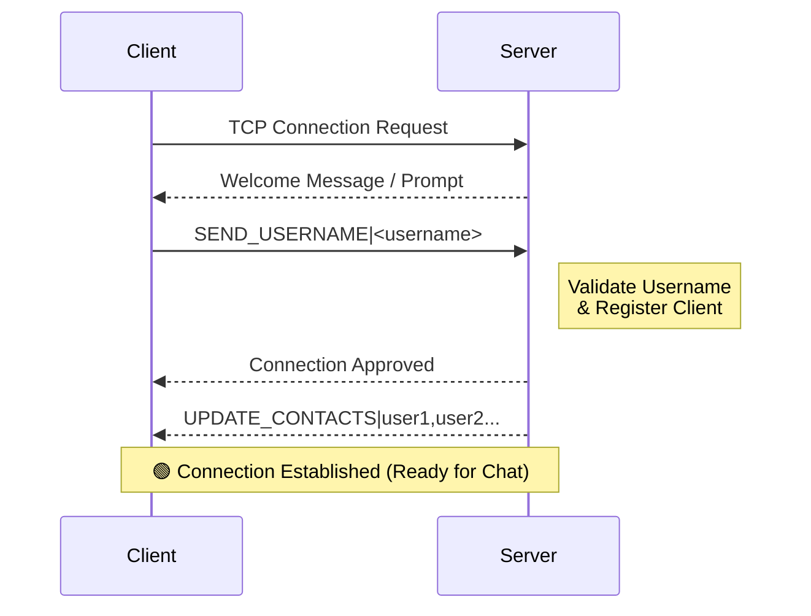

# TCP Messaging System

A lightweight, multi-threaded chat application built from scratch using Python's raw TCP sockets. 
This project demonstrates the implementation of a custom application-layer protocol and manages concurrent client connections without relying on high-level frameworks.

## About The Project


The goal of this project was to dive deep into low-level networking concepts by building a distributed system "the hard way." Instead of using abstract libraries like Socket.IO or HTTP frameworks, this application manages the raw byte streams directly over the TCP/IP stack.

It features a central server that acts as a switchboard, routing messages between connected clients in real-time using a dedicated thread-per-client architecture.

## Project Structure

- `src/server/server.py` — multithreaded chat server with contact broadcasting and max-connection protection.
- `src/client/client.py` — Tkinter-based chat client with local SQLite history, contacts sidebar, and unread indicators.
- `forest-dark.tcl` — Tkinter theme.
- `chat_history.db` / `server_chat.db` — SQLite databases created at runtime.
- `README.md` — project documentation.
- `LICENSE` — project license.

## 💾 Database Schema
# Database Schema

The TCP Messaging System utilizes **SQLite** for data persistence. The system maintains two distinct database structures: one for the central server and one for individual clients.

## 1. Server Database
**File:** `src/server/server_chat.db`

The server stores a central log of all messages routed through the system. It does not store local display metadata (timestamps) as it focuses on routing and raw persistence.

```sql
CREATE TABLE IF NOT EXISTS messages (
    sender TEXT,
    receiver TEXT,
    message TEXT
);

CREATE TABLE IF NOT EXISTS messages (
    sender TEXT,
    receiver TEXT,
    message TEXT,
    timestamp TEXT
);
The system maintains consistency between Server and Client databases, with the Client storing additional metadata (timestamps) for local display.

| Column | Type | Description | Availability |
|:-------|:-----|:------------|:-------------|
| `sender` | TEXT | Username of the sender | 🟢 Both |
| `receiver` | TEXT | Username of the recipient | 🟢 Both |
| `message` | TEXT | The message content | 🟢 Both |
| `timestamp`| TEXT | Local time (HH:MM) | 🔵 **Client Only** |

## Key Features

### Server
* **Custom Protocol:** Text-based application protocol for user registration and message routing
* **Concurrency:** Thread-per-client architecture supporting up to 5 simultaneous connections
* **Message Persistence:** SQLite database storing all messages (Sender, Receiver, Content)
* **Contact Management:** Broadcasts updated contact lists on connect/disconnect events
* **Connection Limits:** Graceful rejection when maximum connections reached
* **Duplicate Username Detection:** Prevents multiple clients with the same username
* **Thread-Safe Operations:** Mutex locks for concurrent client dictionary access

### Client
* **Modern GUI:** Dark-themed Tkinter interface with Forest Dark theme
* **Real-Time Updates:** Live contact list showing online users
* **Unread Indicators:** Visual alerts for new messages from other contacts
* **Chat History:** SQLite persistence with local timestamps for conversation continuity
* **Auto-Reconnection Handling:** Graceful error handling for disconnections
* **Message Timestamps:** Client generates and displays timestamps (HH:MM)
* **Contact Selection:** Click-to-chat interface with active conversation highlighting

## Built With

* **Language:** Python 3
* **Networking:** Raw BSD Sockets (`socket` library)
* **Concurrency:** Multi-threading (`threading` module)
* **GUI:** Tkinter with custom Forest Dark theme
* **Database:** SQLite3

## Getting Started

### Prerequisites
* Python 3.x (includes `socket`, `threading`, `sqlite3`, `tkinter`)
* CustomTkinter

### Installation
1. Clone the repository:
   ```bash
   git clone https://github.com/Intro-To-Computer-Networks-Team/TCP_Chat_Application.git
2. Navigate to the project directory:
   ```bash
   cd TCP_Chat_Application/src
   ```
3. Install CustomTkinter if not already installed:
   ```bash
   pip install customtkinter
    ```

##  Usage
To simulate a chat environment, you will need to run the server in one terminal and multiple client instances in separate terminals.

## ⚙️ Configuration

You can adjust network settings directly in the source files:

**Server Configuration** (`src/server/server.py`):
```python
HOST = '0.0.0.0'  # Listen on all network interfaces
PORT = 4000       # Port number
MAX_CLIENTS = 5   # Connection limit
```
**Client Configuration** (`src/client/client.py`):
```python
SERVER_IP = '127.0.0.1' # Change this to Server IP for remote connection
SERVER_PORT = 4000      # Must match the server port
```

### Step 1: Start the Server
The server binds to all interfaces (`0.0.0.0`) on port `4000` (can be changed).
```bash
cd server
python server.py
```

### Step 2: Start the Client(s)
In separate terminal windows, start multiple client instances to simulate different users.
```bash
cd client
python client.py
```
### Step 3: Using the Client
1. Enter a unique username when prompted.
2. Select a contact from the sidebar to start chatting.
3. Type messages in the input box and press "Send" or hit Enter to send messages
4. New messages from other contacts will trigger unread indicators.
5. Chat history is saved locally and displayed with timestamps.
6. The contact list updates in real-time as users connect or disconnect.

### Protocol Specification

| Message Type       | Format                     | Example                          |
|--------------------|----------------------------|----------------------------------|
| **User Registration** | `username`                | `alice`                          |
| **Direct Message**    | `recipient:message_content` | `bob:Hello there!`               |
| **Server Messages**   | `[Server]: message_content` | `[Server]: User 'alice' has disconnected.` |
| **Contact Updates**   | `CONTACTS:user1,user2,user3` | `CONTACTS:alice,bob,charlie`     |

### Connection Flow Diagram


## 🔧 Troubleshooting

Common issues and fixes:

* **WinError 32 (File used by another process):**
    * This happens if the database file is locked. Ensure all client/server instances are closed. If the issue persists, delete the `.db` file and restart.
* **Connection Refused:**
    * Ensure the server is running *before* starting the client.
    * Check that the IP in `client.py` matches the server's IP (default: `127.0.0.1` or `localhost`).
* **WinError 10054 (Connection Reset):**
    * The server was forcibly closed. Restart the server and then the clients.
* **Duplicate Username Error:**
  * Ensure each client uses a unique username when connecting.
  * If a username is already taken, the server will reject the connection.
* **Max Connections Reached:**
    * The server allows a maximum of 5 concurrent connections. If this limit is reached, new clients will be rejected until a slot frees up.
    * Close existing client connections to free up space.
* **Database Errors:**
  * Ensure that the SQLite database files (`chat_history.db` and `server_chat.db`)
  * are not corrupted. If issues persist, delete the database files to allow fresh creation on the next run.
## 📂 Project Structure

```text
TCP_Chat_Application/
├── src/
|   |── screenshots/     
│   │   ├── server_running.png  # Server terminal screenshot
│   │   └── client_gui.png      # Client GUI screenshot
│   │
│   ├── server/
│   │   ├── server.py        # Central server logic & socket binding
│   │   └── server_chat.db   # (Generated) Server logs/database
│   │
│   └── client/
│       ├── client.py        # GUI Client application (Tkinter)
│       ├── forest-dark.tcl  # Theme definition file
│       ├── forest-dark/     # Theme assets (images/styles)
│       ├── chat_history.db  # (Generated) Local chat history
│       └── assets/        # Additional client assets
│            └──logo.png   # Application logo
│
└── README.md
```

## Acknowledgments
* Inspired by the need to understand low-level networking concepts.
* Thanks to the Python community for extensive documentation on sockets and threading.
* Tkinter resources for GUI development.
* SQLite documentation for database management.
* Open-source projects that demonstrate similar concepts.
* Special thanks to team members for collaboration and testing.
  
## License
This project is licensed under the MIT License - see the [LICENSE](LICENSE) file for details.


